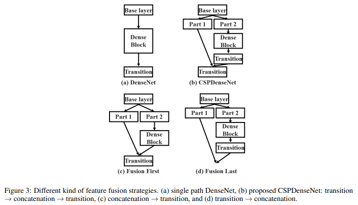
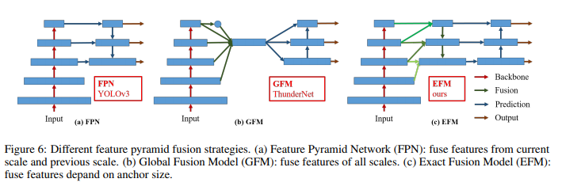
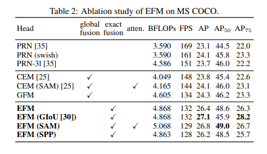
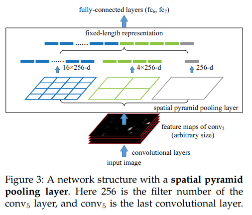
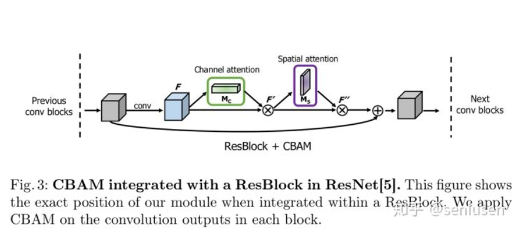
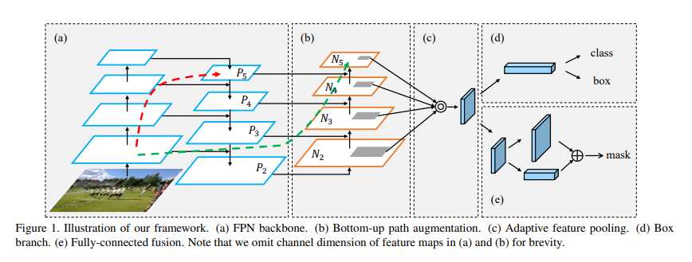
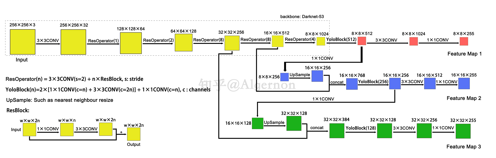

# Timeline - Interview_Preparation
05/04/2020

Apply for jobs at Snap, Lucid Motor, Inceptio

Study YOLOv4(CSPNet) and finished setting up environement for YOLOv4:

YOLOv4 consists of:
+ Backbone: CSPDarknet53 
+ Neck: SPP, PAN 
+ Head: YOLOv3 

---

+ [CSPNet](https://github.com/WongKinYiu/CrossStagePartialNetworks) (Cross Stage Partial Network): 
+ **Advantage**: It's able to reduce computations by 20% with a bit superior accuracy. It can cope with architectures based on ResNet, ResNeXt, and DenseNet.
+ **Methods:** 
+ **Classification:** In order to strengthen learning bability of a CNN, **the feature maps of base layer are evenly split into two parts**, the latter one will go through the block (can be Dense block), then undergo a transition layer, next concatenate with the former part and undergo another transition layer. The author claims that both parts do not contain duplicate gradient info that belong to the other parts by truncating the gradient flow.
+ 
+ **Detection:** Exact fusion model with Maxout operation. In the experiment settings, **GIoU,  SPP (Spatial Pyramid Pooling) and SAM (Spatial Attention Module)** are also applied to the EFM to conduct an ablation study. If compared to object detectors running at 30∼100 fps, **CSPResNeXt50 with PANet (SPP)** achieves the best performance
in AP, AP50 and AP75. They receive, respectively, 38.4%, 60.6%, and 41.6% detection rates.  
+ 
+ 
+ **Inference rate:** If your detector is running on mobile GPU, use EFM based network, it can reduce the memory requirements when generating feature pyramids.

+ Before running [YOLOv4](https://github.com/AlexeyAB/darknet#how-to-use-on-the-command-line)

```cpp
// if use opencv, also don't forget to install opencv
sudo apt install libopencv-dev 

//change Makfile
// if use gpu
COMMON+= -DGPU -I/usr/local/cuda-10.2/include/
LDFLAGS+= -L/usr/local/cuda-10.2/lib -lcuda -lcudart -lcublas -lcurand
LDFLAGS+= -L/usr/local/cuda-10.2/lib64 -lcuda -lcudart -lcublas -lcurand

CFLAGS+= -DCUDNN -I/usr/local/cuda-10.2/include
LDFLAGS+= -L/usr/local/cuda-10.2/lib -lcudnn

CFLAGS+= -DCUDNN -I/usr/local/cudnn-10.2/include
LDFLAGS+= -L/usr/local/cudnn-10.2/lib64 -lcudnn


//add lines below to the ~/.bashrc, then source ~/.bashrc
export PATH=/usr/local/cuda-10.2/bin:$PATH
export LD_LIBRARY_PATH=/usr/local/cuda-10.2/lib64:$LD_LIBRARY_PATH
```

05/05/2020

Apply for jobs at DiDi, Nvidia, Skydio

1) Study YOLOv4(SPP)
2) Leetcode update

+ [SPP](https://arxiv.org/pdf/1406.4729.pdf) (Spatial Pyramid Pooling):
+ SPP eliminate the requirements of the fixed input size of the existed deep neural networks by generating a fixed-length representation regardless of image size/scale. It has been shown to be robust to object deformation.
+ To adopt SPP, we need to replace the last pooling layer (after the last convolutional layer) if any to the spatial pyramid pooling layer. The output of spatial pyramid pooling layer is kM - dimensional vector with the number of bins denoted as M (k is the number of filters in the last convolutional layer), the fixed-dimensional vectors are the input to the fully-connected layer.  
+ 
+ How do we train the SPP? We train each full epoch on one network, and then switch to the other one (keeping all weights) for the next full epoch...Author shows the example of training R-CNN with SPP in the paper.

05/06/2020

Apply for jobs at WeRide, Zoox, Voyage, Kwai, Pony

1) Study YOLOv4(SAM, PANet, YOLOv3)
2) Read the code of YOLOv4
3) Leetcode update (78. Subsets, 75. Sort Colors, 79. Word Search)

+ [SAM](https://arxiv.org/pdf/1807.06521.pdf)(Spatial attention module): 
+ Add the SAM on the convolution output in each block.
+ 

```python
def CBAM(input, reduction):
    """
    @Convolutional Block Attention Module
    """

    _, width, height, channel = input.get_shape()  # (B, W, H, C)

    # channel attention
    x_mean = tf.reduce_mean(input, axis=(1, 2), keepdims=True)   # (B, 1, 1, C)
    x_mean = tf.layers.conv2d(x_mean, channel // reduction, 1, activation=tf.nn.relu, name='CA1')  # (B, 1, 1, C // r)
    x_mean = tf.layers.conv2d(x_mean, channel, 1, name='CA2')   # (B, 1, 1, C)

    x_max = tf.reduce_max(input, axis=(1, 2), keepdims=True)  # (B, 1, 1, C)
    x_max = tf.layers.conv2d(x_max, channel // reduction, 1, activation=tf.nn.relu, name='CA1', reuse=True)
    # (B, 1, 1, C // r)
    x_max = tf.layers.conv2d(x_max, channel, 1, name='CA2', reuse=True)  # (B, 1, 1, C)

    x = tf.add(x_mean, x_max)   # (B, 1, 1, C)
    x = tf.nn.sigmoid(x)        # (B, 1, 1, C)
    x = tf.multiply(input, x)   # (B, W, H, C)

    # spatial attention
    y_mean = tf.reduce_mean(x, axis=3, keepdims=True)  # (B, W, H, 1)
    y_max = tf.reduce_max(x, axis=3, keepdims=True)  # (B, W, H, 1)
    y = tf.concat([y_mean, y_max], axis=-1)     # (B, W, H, 2)
    y = tf.layers.conv2d(y, 1, 7, padding='same', activation=tf.nn.sigmoid)    # (B, W, H, 1)
    y = tf.multiply(x, y)  # (B, W, H, C)

    return y

```


+ [PANet](https://arxiv.org/pdf/1803.01534.pdf)(Path Aggregation Network for Instance Segmentation):
+ Three improvements from Mask-RCNN to PANet
  + Add bottom-up path augmentation to FPN.
  + Adpative feature pooling: Originally we select the ROI features from one of feature maps from p2 to p5, depending on the size of ROI. The author argues that selecting from all levels of feautre maps is able to capture richer context information.
  + Fully-connected Fusion:(skip)
+ 

+ Since the head of YOLOv3 is used in v4, I add one pic from [link](https://zhuanlan.zhihu.com/p/76802514) to recap.
+ 

